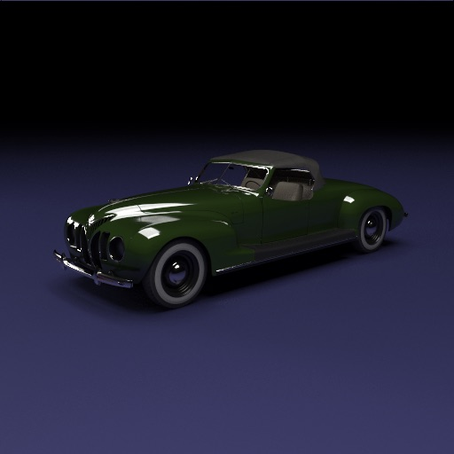
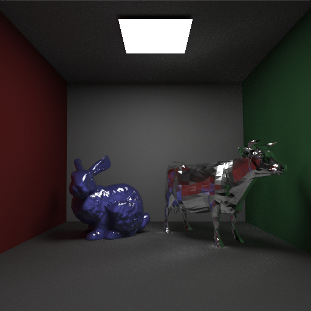

# CoWaltz

A photorealistic path-tracing renderer built for fun

ZIS-101A Sport (1938) (707477 polygons, 4096 samples per pixel)

Cornell Box with Bunny and Cow. The noise in this image is due to caustics from the reflective cow, which is one of the downfalls of unidirectional path tracing.

Currently supports:
- Disney BSDF (Glossy Reflection, Glass, etc.)
- Texture Mapping (& Normal Mapping)
- Phong Shading
- Area Lights (& Soft Shadows)
- Depth of Field
- A bunch of optimization techniques to make it run in finite time lol
