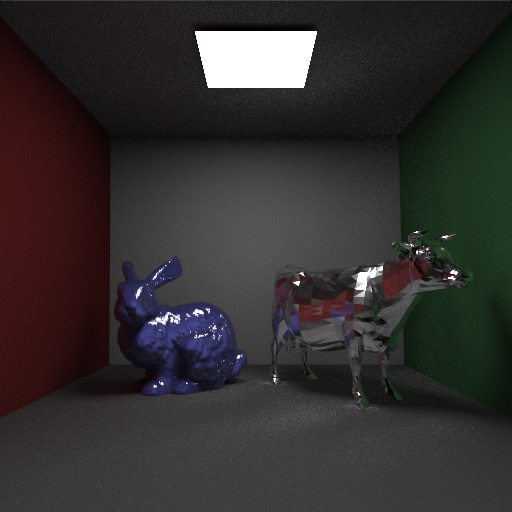

# CoWaltz

A photorealistic path-tracing renderer built for fun

Currently supports a subset of Disney BSDF, texture mapping, depth of field, area lights, and more.

ZIS-101A Sport (1938) (707477 polygons, 4096 samples per pixel, ~2 hours to render)

Cornell Box with Bunny and Cow. The noise in this image is due to caustics from the reflective cow, which is one of the downfalls of unidirectional path tracing.

